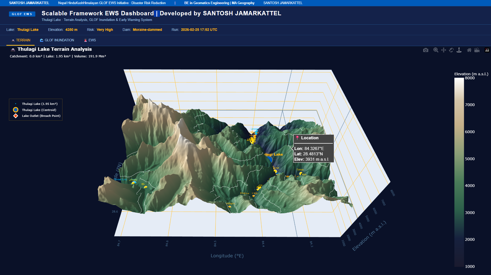
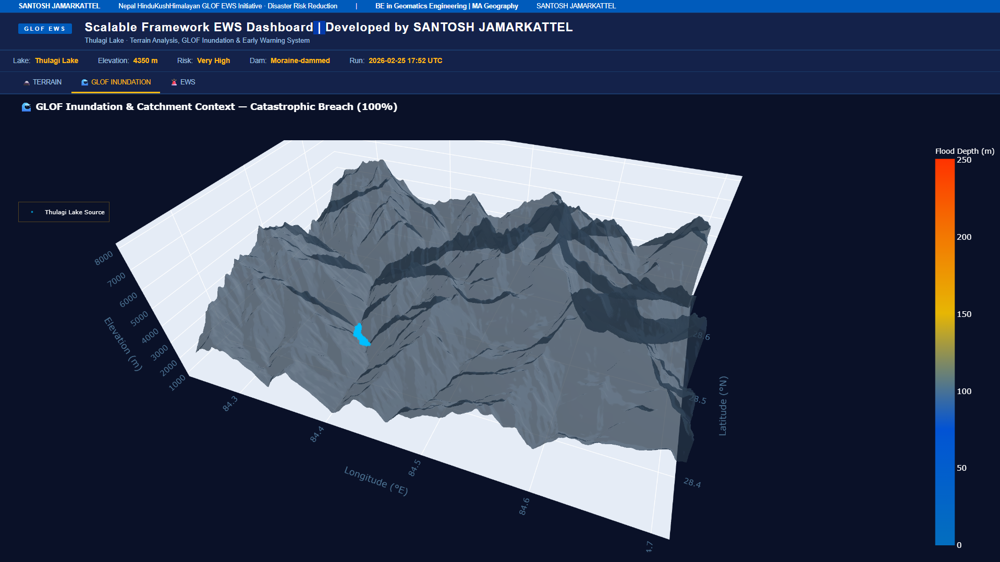
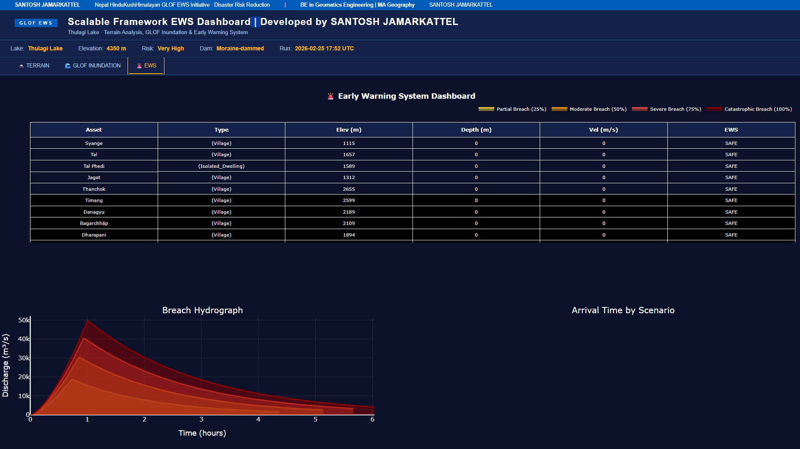

# 🗻 Thulagi Lake GLOF Early Warning Dashboard (HTML Release)

This repository hosts the **interactive HTML dashboard** generated from the  
**GLOF‑DIMS Enhanced Early Warning System (EWS)** for **Thulagi Lake, Nepal**.
This can be scaled to Real-Time Early Warning System. 

The dashboard is a standalone, browser‑based interface that visualizes  
**Glacial Lake Outburst Flood (GLOF) hazard**, **inundation modelling**,  
**terrain analysis**, and **Early Warning System (EWS) risk layers**.

---

## 📸 Dashboard Preview

### **Terrain Analysis (3D Visualization)**

### **GLOF Inundation — Catastrophic Breach Scenario (100%)**

### **GLOF DIMS EWS Dashboard**

> _Screenshots from the interactive HTML dashboard included in this repository._

## 📌 Overview

This HTML dashboard provides fully interactive visualisations including:

- 🗻 **3D terrain analysis**
- 🌊 **GLOF inundation simulation**
- 🚨 **EWS classification** (Evacuate / Warning / Watch / Safe) 
- 🏘 **Exposure mapping** (settlements, schools, health posts, assembly points)
- 📈 **Breach hydrograph plots**
- 📊 **Scenario‑based risk summaries**
- 📡 **Asset‑level arrival time & risk indicators**

The file runs entirely in your browser with **no installation needed**.

---

## 📁 Repository Contents

| File | Description |
|------|-------------|
| **`GLOF_DIMS_EWS_Dashboard.html`** | The complete interactive dashboard (open in any browser). |
| **`README.md`** | Documentation for understanding and using the dashboard. |

---

## 🚀 How to Use the Dashboard

1. **Download** the HTML file  
2. Open it in any modern browser: Chrome, Firefox, Edge, or Safari  
3. Explore the three main tabs:
   - **TERRAIN** → 3D DEM view, lake, catchment, and assets  
   - **GLOF INUNDATION** → Flood depth & impacted zone  
   - **EWS** → Breach hydrographs, arrival time charts, and risk matrix  

No external dependencies. No server required. Fully offline after opening.

---

## 🌍 Data & Modelling Background

Although this repository contains *only* the HTML dashboard, the original system used:

- **OpenStreetMap** for exposed community assets  
- **Hydrologic flow modelling**, **GLOF breach simulation**, and  
  **EWS risk assessment** via a custom-built geospatial workflow.

---

## 👤 Author

**Santosh Jamarkattel**  
Geomatics Engineer & Geospatial | GeoAI Developer  
Nepal Hindu Kush Himalayan Region  

---

## 📜 License

The dashboard is shared for **research, education, and DRR (Disaster Risk Reduction)** purposes.  
Please provide appropriate credit if used in publications, reports, or training materials.

---

### ⭐ If you find this dashboard useful, please consider starring the repository!
